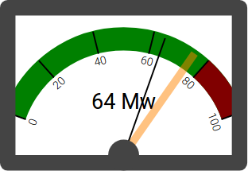

# swinging-needle-meter

A [re-frame](https://github.com/Day8/re-frame) application designed to display an example swinging needle meter, as an experiment in animating SVG from re-frame. Draws heavily on re-com.

Works well in Chrome and Firefox; not tested in Internet Exploder.



## Demo site

There's a demo site [here](https://simon-brooke.github.io/swinging-needle-meter/resources/public/index.html).

## Intended uses

This is a component for a console, typically one controlling a technical or scientific instrument. It is
by design flexible and configurable. Minimum value, maximum value, warning value and number of gradations
shown are all configurable, as are (obviously) styles.

A cursor will be shown if the value of *setpoint* is between *min-value* and *max-value*; *setpoint* is a dynamic value which is watched during the run. While the *model* value is within +- *tolerance* of the *setpoint* value, a class *target-class* is set on the meter indicating an on-target status (by default the frame goes green).

A red-zone may be shown if a *warn-value* is set which is between *min-value* and *max-value*. If such a *warn-value* is set, then if the current value (*model*) exceeds *warn-value*, a class *warning-class* is set on the meter indicating a warning status (by default the frame goes maroon).

## Development Mode

### Run application:

```
lein clean
lein figwheel dev
```

Figwheel will automatically push cljs changes to the browser.

Wait a bit, then browse to [http://localhost:3449](http://localhost:3449).

## Production Build


To compile clojurescript to javascript:

```
lein clean
lein cljsbuild once min
```

## License
Copyright © 2017 Simon Brooke. Licensed under the GNU General Public License,
version 2.0 or (at your option) any later version. If you wish to incorporate
parts of this into another open source project which uses a less restrictive
license, please contact me; I'm open to dual licensing it.
